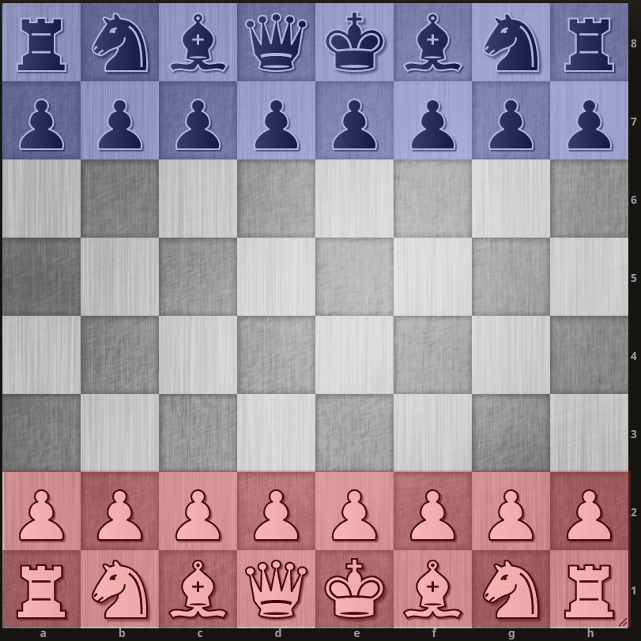

+++
title = "ParChess"
slug = "parchess"
date = 2021-06-26
+++

Chess is one of the oldest and greatest games ever. Over the years there have been many variants of the game like triple
check, antichess, king of the hill. [Chess.com](https://www.chess.com/variants) and [Lichess.org](https://lichess.org/)
have added these variants on their website as well. 4 player chess is a variant that came out a few years ago that
allowed 4 persons to play chess full board.

This post came from a shower thought that I had. Why do we move only 1 piece at a time in chess? Many agree that in the
game, white is automatically advantages due to the first move. This is also why in armageddons the
[rules](https://www.chess.com/terms/armageddon-chess) are made to even the playing field. If having the first move is
already so advantages then having 2 or more moves first would be a huge advantage. But is that true if both players have
the same number of moves, should the position not be fairly equal?

It's not that no one ever played with more number of moves. It has been played as a sort of odds game, where the
stronger player allows the other to play 2 moves at a time. But the intention of playing multiple moves is a bit
different in my thought up variant.

The variant which I'd like to call parchess which stands for parallel chess, It is simply to divide the board to enable
N players to play simultaneously that is each player moves once per turn. Here N is a number greater than 0. And
par-2-chess is normal chess. Then we have the below divisons:

| Variant Name | Number of players | Board                                                 |
| ------------ | ----------------- | ----------------------------------------------------- |
| par-1-chess  | 1                 |                          |
| par-2-chess  | 2                 |  |
| par-3-chess  | 3                 |  |
| par-4-chess  | 3                 |  |
| par-5-chess  | 3                 |  |

The board divisions are very primative, maybe it would be more ideal to make divisions based on the sum of the piece
values. I can imagine it being playable (mindbendingly) till par-16-chess where each player would have a piece and it's
pawn. The variant goes upto par-32-chess wherein each player controls a single piece. Almost feels chaotic when 16 moves
occur in 1 turn.

Although the actual gameplay might become unplayable after par-4-chess, mainly because all moves on each side have to be
made each turn. Each side has visibilty into their side's moves, we can't have them moving into the same square. And
given it becomes more of a team game, depending on whether discussing moves be allowed or not, the time per move could
be very high.

I feel the concept is like mixing Turn-based Strategy (TBS) and Real-Time Strategy (RTS) game mechanics to chess which
is purely turn-based.

Interesting found this version of [RTS chess](https://rtschess.herokuapp.com/). No turns at all, after moving a piece it
has a cooldown time before moving it again.
